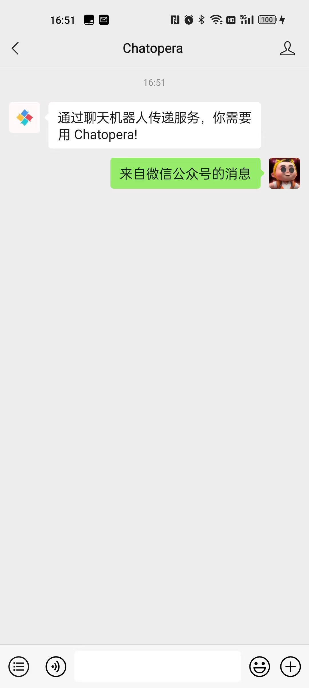
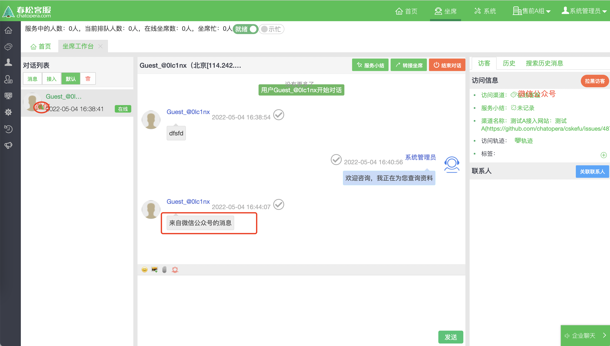

# 微信渠道

## 微信渠道简介
春松客服作为多渠道开源客服系统，可以支持多种的 IM 渠道，比如 网页 WebIM、电话、微信、钉钉等。这里主要讨论将微信公众号和小程序作为一种IM渠道。
访客进入微信公众号或者微信小程序的聊天界面，可以给客服发送消息。消息将通过微信进入春松客服的`坐席工作台`，有对应的人工客服或机器人客服负责接待访客，客服只要专注在春松客服`坐席工作台`解答访客的疑问，方便快捷高效。

## 设计草图

#### 访客端


#### 坐席端


## 功能开发
- 微信公众号与春松客服打通，互相发送接收消息（富文本）。
- 微信小程序客服渠道与春松客服打通，互相发送接收消息（富文本）。
- 从微信渠道向春松客服发送消息，春松客服坐席工作台弹出弹屏幕和消息提醒。
- 坐席工作台，坐席人员可以看到访客的基本信息（渠道信息、微信昵称）

<!-- 在此之上添加内容, https://stackoverflow.com/questions/16965490/pandoc-markdown-page-break -->
```{=openxml}
<w:p>
  <w:r>
    <w:br w:type="page"/>
  </w:r>
</w:p>
```
