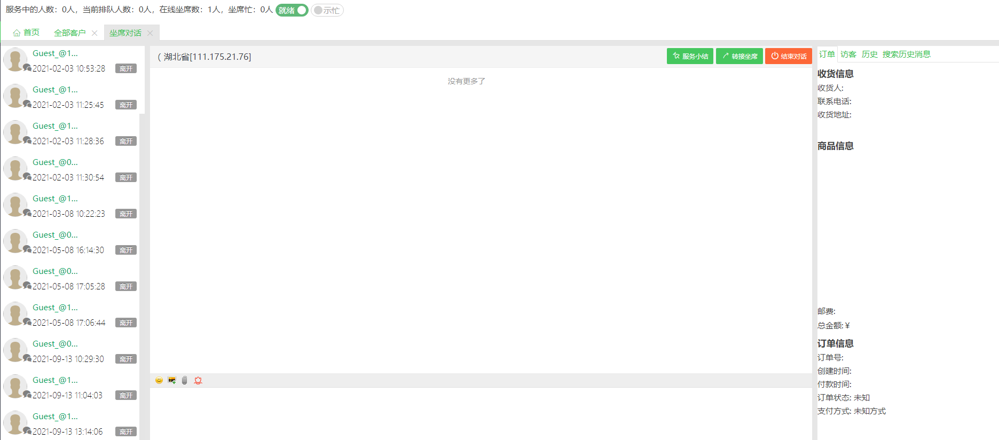

# 坐席工作台

## 支持自定义业务数据展示

### 功能概述

系统管理员在业务数据配置功能中，配置好要展示的业务数据的请求信息，以 http 请求向业务系统请求业务数据。请求的结果以自义 UI 的方式展示在客服对话窗口右侧面板中

### 功能说明

#### 业务数据配置

全局配置：

- 认证方式：Token 认证或密码认证，用于在请求接口数据时鉴权
- 默认参数：如分页参数

局部配置：针对每一项要展示的数据的配置，主要包括：

- 请求 URL
- 请求方式，支持只读的 get、post 请求，用以获取数据
- 认证信息，全局配置中的 Token 等
- 必须的参数
- UI 配置，支持列表展示

步骤：

1. 鼠标右键--> 添加请求 (配置请求信息，如 URL、请求方式等) --> 发送请求
2. 解析请结果
3. 根据请求结果配置 UI
4. 预揽

#### 业务数据展示

展示位置：客服对话窗口右侧面板

展示时机：打开对话窗口时，展示对方在业务系统中的数据

数据如何获取：在客服系统中存储客服系统的客户 ID 和业务系统的客户 ID 的关联关系，打开对话窗口时，将业务系统的客户 ID 携带在 http 请求中，向业务系统请求所需的业务数据

展示效果：

